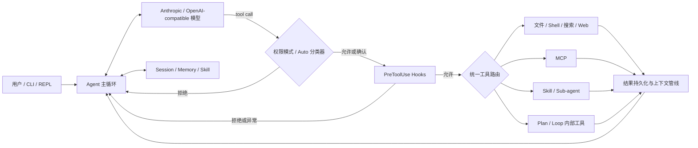

<div align="center">

# Lion Code

**一个强调执行可控、长会话效率与经验复用的轻量级 Python Coding Agent**

[](https://www.python.org/)
[](LICENSE)
[](#当前边界与路线图)

[快速开始](#快速开始) · [核心机制](#核心机制) · [架构](#架构与执行流程) · [评测](#可复现评测) · [路线图](#当前边界与路线图)

</div>

Lion Code 可以读取和修改项目文件、执行 Shell 命令、搜索代码，并通过 Anthropic 或 OpenAI 兼容接口驱动完整的 Agent 工具循环。项目重点不在堆叠工具数量，而在探索 Coding Agent 真正进入长任务后必须面对的三个问题：

- **工具怎样安全执行**：权限模式、人工确认与 PreToolUse Hook 共同构成执行边界；
- **上下文怎样持续工作**：大结果持久化、动态预算、缓存热度感知和摘要组成多级压缩管线；
- **经验怎样被再次使用**：会话、Memory、Skill 与显式 `/learn` 提供不同层次的持久化能力。

> [!NOTE]
> **演示动图待补充。** 建议录制 20～30 秒终端流程：让 Lion Code 定位问题、修改文件、运行测试，再由 PreToolUse Hook 拒绝一次危险命令。将文件保存为 `docs/assets/demo.gif` 后放在这里。

## 为什么做 Lion Code

许多 Coding Agent 示例在完成“模型调用工具，再把结果送回模型”后就结束了。真正影响长任务可靠性的，往往是之后的问题：超大工具结果撑满上下文、缓存前缀被频繁改写、危险操作绕过审批、会话经验无法复用，以及任务中断后缺乏可追踪状态。

Lion Code 的目标是提供一个规模可读、行为可验证的 Agent Runtime，用较少的依赖实现这些关键机制，并为每项重要结论保留源码、测试或 Benchmark 证据。

> **项目背景待补充：** 请补充你为什么开始这个项目、哪些模块由你独立设计、项目参考或借鉴了哪些工作，以及你希望通过它验证什么工程判断。面试官通常会特别关注这部分。

## 核心亮点

| 能力 | 实现方式 | 可核验入口 |
|---|---|---|
| 可控工具执行 | 静态权限、人工确认、Auto 分类器与 fail-closed PreToolUse Hook | [`agent.py`](lion_code/agent.py)、[`hooks.py`](lion_code/hooks.py)、[`test_hooks.py`](tests/test_hooks.py) |
| 长上下文管理 | 大结果落盘、动态预算、陈旧结果裁剪、空闲清理与 85% 水位摘要 | [`agent.py`](lion_code/agent.py)、[正式评测脚本](benchmarks/context_management/formal_benchmark.py) |
| 缓存热度感知 | 缓存仍热且利用率未超过 75% 时延迟改写旧前缀 | [正式评测结果](benchmarks/context_management/results/formal-latest.json) |
| 显式经验沉淀 | `/learn` 分析当前会话，只在用户主动触发后创建项目级或用户级 Skill | [`skills.py`](lion_code/skills.py)、[`test_learning.py`](tests/test_learning.py) |
| 可扩展工具生态 | 内置工具、MCP、Skill、Sub-agent 和 Plan 内部工具共用统一路由 | [`agent.py`](lion_code/agent.py)、[`mcp_client.py`](lion_code/mcp_client.py) |
| 多模型后端 | 同时适配 Anthropic API 与 OpenAI-compatible API | [`__main__.py`](lion_code/__main__.py) |

## 架构与执行流程



一次工具调用按以下顺序执行：

1. 权限模式或 Auto 分类器先决定 `allow`、`confirm` 或 `deny`；
2. 需要确认的操作由用户批准后继续；
3. 匹配的 PreToolUse Hook 按顺序执行；
4. 通过 Hook 后，调用才会进入内置工具、MCP、Skill、Sub-agent 或内部工具路由；
5. 超大结果先完整落盘，再把路径和预览写回上下文；
6. 工具结果进入下一轮模型调用前，由上下文管理管线控制预算。

因此，Hook 返回 `allow` 不能绕过原有权限，权限拒绝时也不会启动 Hook。即使使用 `--yolo` 跳过人工确认，PreToolUse Hook 仍然是独立的附加拦截层。

## 核心机制

### 1. Fail-closed 工具边界

Lion Code 支持以下权限模式：

| 模式 | CLI 参数 | 行为 |
|---|---|---|
| Default | 默认 | 只读操作走快路径，敏感操作按规则确认或拒绝 |
| Plan | `--plan` | 只读分析并生成计划，不直接修改项目 |
| Accept Edits | `--accept-edits` | 自动批准文件编辑，危险 Shell 仍需确认 |
| Don't Ask | `--dont-ask` | 自动拒绝所有需要人工确认的操作，适合非交互环境 |
| Auto | `--auto` | 由两阶段 LLM 分类器判断操作，当前属于实验能力 |
| Yolo | `--yolo` | 跳过人工确认，仅建议在隔离环境中使用 |

PreToolUse Hook 可以调用任意命令行程序检查工具输入。Hook 超时、崩溃、非零退出、输出过大、非法 JSON 或未知 `action` 时，本次工具调用都会被拒绝，但 Agent 循环不会崩溃。

<details>
<summary>查看 PreToolUse Hook 最小配置</summary>

项目级配置位于 `.claude/settings.json`，用户级配置位于 `~/.claude/settings.json`：

```json
{
  "hooks": {
    "PreToolUse": [
      {
        "matcher": "run_shell",
        "command": "python .claude/hooks/pre_shell.py",
        "timeout_ms": 5000
      }
    ]
  }
}
```

Hook 从 stdin 接收 UTF-8 JSON，并在 stdout 返回单个 JSON 对象：

```json
{"action": "allow"}
```

或：

```json
{"action": "deny", "reason": "当前项目禁止直接推送"}
```

项目级 Hook 等同于执行仓库提供的代码，只应在受信任的工作区中启用。修改配置后需要重启 Lion Code。

</details>

### 2. 多级上下文管理

Lion Code 不只在上下文即将溢出时做一次摘要，而是逐级处理不同来源的浪费：

| 阶段 | 触发条件 | 行为 |
|---|---|---|
| 大结果持久化 | 工具结果超过 30 KiB | 全文保存到 `~/.lion-code/tool-results/`，上下文只保留路径和前 200 行预览 |
| 动态结果预算 | 上下文利用率超过 50% | 根据利用率限制单个工具结果长度，同时保留首尾信息 |
| 陈旧结果裁剪 | 利用率超过 60% | 保留最近结果和同一文件的最新读取；缓存仍热时优先延迟改写 |
| 空闲清理 | 距离上次 API 调用超过 5 分钟 | 清理更早的工具结果，保留最近 3 项 |
| 全量摘要 | 超过有效窗口的 85% | 用模型摘要历史，同时保留继续任务所需的决策、路径和上下文 |

这套策略同时考虑“发送了多少 Token”和“是否破坏供应商前缀缓存”，避免只追求上下文变短，却让缓存未命中费用反而增加。

### 3. 显式经验沉淀

`/learn` 不会在后台自动写入知识。只有用户主动执行命令后，Lion Code 才会分析当前会话，并判断其中是否存在值得复用的稳定流程、非显然故障恢复方法或项目约定。

```text
当前会话 → Meta-Skill 判断 → 不建议沉淀
                         └→ 创建项目级或用户级 SKILL.md
```

这种设计减少了自动沉淀错误经验、临时结论或敏感内容的风险。

## 可复现评测

项目使用当前仓库源码构造了 9 项可执行编码任务，覆盖 60%～70%、75%～85% 和 85%～95% 三档上下文负载。每项任务在三种策略下重复两次，共完成 54 个真实 API 会话。

评测环境：`deepseek-v4-flash`、OpenAI-compatible 非思考模式、180K 有效窗口。

### 完整管线与单阶段摘要

| 指标 | `summary_only` | `managed` |
|---|---:|---:|
| 成功任务 | 13 / 18 | **14 / 18** |
| 累计输入 Token | 14,560,434 | **12,872,748** |
| 峰值输入 Token | 175,546 | **145,581** |
| 完整会话 API 费用 | 4.6672 元 | **4.4865 元** |

- 含摘要累计输入 Token 减少 **11.6%**，配对 bootstrap 95% CI 为 `[9.1%, 14.4%]`；
- 完整会话 API 费用观测下降 **3.9%**，但 95% CI 为 `[-7.2%, 13.6%]`，区间跨 0，因此不宣称已证明费用显著下降；
- 缓存热度感知策略相对提前裁剪策略，将命中率从 64.2% 提高到 66.6%，但对应区间同样跨 0。

这是基于受控编码任务的机制评测，不代表生产流量。原始数据、任务定义和统计口径均保留在仓库中：

- [正式评测脚本](benchmarks/context_management/formal_benchmark.py)
- [任务集](benchmarks/context_management/formal_dataset.json)
- [任务验收逻辑](benchmarks/context_management/formal_tasks.py)
- [完整原始结果](benchmarks/context_management/results/formal-latest.json)

离线校验任务集不需要 API：

```powershell
python benchmarks/context_management/formal_benchmark.py
```

运行完整在线评测会产生真实费用：

```powershell
$env:OPENAI_API_KEY = "<你的 API Key>"
python benchmarks/context_management/formal_benchmark.py --online `
  --base-url "https://api.deepseek.com" `
  --model "deepseek-v4-flash" `
  --budget-cny 15
```

## 快速开始

需要 Python 3.11 或更高版本。

```powershell
git clone https://github.com/muyuzhong/Lion-Code.git
cd Lion-Code
python -m venv .venv
.venv\Scripts\Activate.ps1
python -m pip install -e .
```

<details>
<summary>macOS / Linux 虚拟环境命令</summary>

```bash
python3 -m venv .venv
source .venv/bin/activate
python -m pip install -e .
```

</details>

### Anthropic API

```powershell
$env:ANTHROPIC_API_KEY = "<你的 API Key>"
lion-code "读取当前项目并总结最重要的执行路径"
```

可通过 `ANTHROPIC_BASE_URL` 设置兼容代理地址。

### OpenAI-compatible API

```powershell
$env:OPENAI_API_KEY = "<你的 API Key>"
$env:OPENAI_BASE_URL = "https://api.openai.com/v1"
lion-code --model "gpt-4o" "检查这个项目并运行测试"
```

也可以使用 `--api-base` 显式指定接口地址。`LION_CODE_MODEL` 可设置默认模型。

### 常用命令

```powershell
lion-code --plan "设计一个重构方案"
lion-code --accept-edits "修复测试并说明原因"
lion-code --max-cost 0.50 --max-turns 20 "完成任务 X"
lion-code --resume
lion-code
```

交互式 REPL 支持：

| 命令 | 作用 |
|---|---|
| `/clear` | 清空当前对话 |
| `/plan` | 切换 Plan 模式 |
| `/cost` | 查看 Token 使用量和费用 |
| `/compact` | 手动压缩当前对话 |
| `/learn` | 判断并沉淀当前会话中的可复用经验 |
| `/memory` | 查看已保存的记忆 |
| `/skills` | 查看可用 Skill |
| `/goal <条件>` | 围绕停止条件继续迭代 |
| `/loop <任务>` | 按间隔或模型指定时间重复任务 |
| `/<skill-name>` | 调用一个用户可执行 Skill |
| `exit` / `quit` | 退出程序 |

## 设计取舍

| 问题 | Lion Code 的选择 | 代价与边界 |
|---|---|---|
| 超大结果会挤占上下文 | 先完整落盘，再提供预览和可回读路径 | 增加本地 I/O，但避免永久丢失内容 |
| 立即裁剪能减少 Token | 缓存仍热时延迟改写旧前缀 | 短期保留更多 Token，换取更高缓存复用机会 |
| Hook 故障时是否继续执行 | 所有异常均 fail-closed | Hook 故障会降低可用性，但不会静默绕过安全边界 |
| 是否自动学习所有会话 | 只在显式 `/learn` 后创建 Skill | 自动化程度更低，但用户保留最终控制权 |
| 如何避免覆盖外部修改 | 写文件前要求先读，并校验 mtime | 多一次读取，换取更清晰的并发修改保护 |

## 项目结构

```text
Lion-Code/
├── lion_code/
│   ├── __main__.py     # CLI 与 REPL 入口
│   ├── agent.py        # Agent 主循环、工具路由与上下文管线
│   ├── tools.py        # 内置工具与静态权限规则
│   ├── autonomy.py     # Auto、Goal 与 Loop 契约
│   ├── hooks.py        # PreToolUse Command Hook
│   ├── memory.py       # 项目 Memory
│   ├── session.py      # 会话持久化
│   ├── skills.py       # Skill 发现、解析与创建
│   ├── subagent.py     # Sub-agent 配置
│   └── mcp_client.py   # MCP 客户端
├── benchmarks/
│   └── context_management/  # 上下文管理评测、任务集与原始结果
├── tests/                    # 单元测试与流程测试
├── pyproject.toml            # 打包、依赖与 CLI 入口
└── README.md
```

运行时数据默认写入用户目录：

```text
~/.lion-code/
├── sessions/       # 会话记录
├── projects/       # 按项目隔离的 Memory
└── tool-results/   # 超大工具结果全文
```

## 测试

```powershell
python -m unittest discover -s tests -p "test_*.py" -v
python -m compileall -q lion_code tests
python benchmarks/context_management/formal_benchmark.py
```

## 当前边界与路线图

Lion Code 目前更适合作为可读、可实验的 Coding Agent Runtime，而不是成熟 Coding Agent 产品的直接替代品。

- [ ] **演示素材**：补充终端 GIF、代表性任务记录和结果截图；
- [ ] **项目背景**：补充设计动机、个人贡献边界和参考来源；
- [ ] **Auto Mode**：当前快照未保留默认规则资产，相关流程测试会跳过，应补齐后再标记为稳定能力；
- [ ] **Goal 持久化**：`/goal` 当前根据 transcript 评估停止条件，不是可恢复的持久任务系统，也不能独立运行测试验证结果；
- [ ] **真实后端验证**：`/learn` 已有 Mock 与文件写入测试，仍需补充 Anthropic/OpenAI-compatible 的端到端记录；
- [ ] **持续集成**：补充 Windows、Linux 和多个 Python 版本的 CI 后，再展示测试状态徽章。

## 贡献

欢迎通过 Issue 提交可复现的问题、设计建议或评测改进。Pull Request 请同时提供与改动风险相匹配的测试，并保持 README 对“已实现”和“计划中”能力的描述准确。

## License

[MIT](LICENSE)
